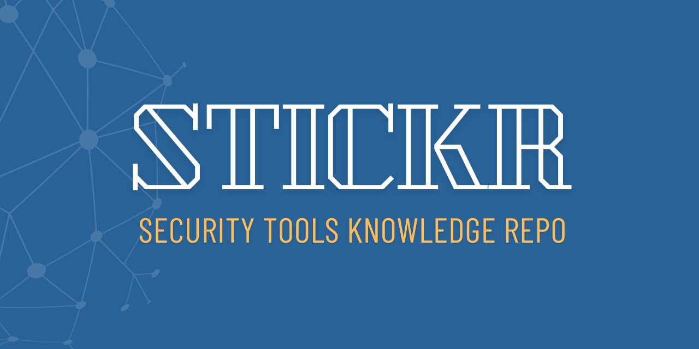

## Introduction

Welcome to the Security Tools Knowledge Repository (STICKR)! This collection serves as a quick reference guide for non-security users who want to understand and utilize various security tools available on Unix-based systems, including macOS.

### Purpose

The primary purpose of this repository is to provide a concise, accessible resource for individuals who may not have extensive security expertise but need to implement basic security measures in their work or personal computing environments. By offering simplified explanations and basic usage examples, we aim to demystify these powerful security tools and encourage their appropriate use.

### Importance

In today's digital landscape, cybersecurity is crucial for everyone, not just IT professionals. Understanding and properly utilizing these tools can significantly enhance your system's security posture, protecting your data and privacy from various cyber threats.

### Cyber-Risks Addressed

This repository covers tools that help mitigate several common cyber-risks, including but not limited to:

1. Unauthorized system access
2. Network intrusions
3. Malware infections
4. Data breaches
5. File system integrity compromises
6. Encrypted communication interception

By familiarizing yourself with these tools, you'll be better equipped to defend against these risks and maintain a more secure computing environment.

### Disclaimer

The information provided in this repository is intended as a starting point and quick reference. While we strive to provide accurate and helpful information, the field of cybersecurity is complex and constantly evolving. Therefore:

1. Always refer to the official documentation for each tool for the most up-to-date and comprehensive information.
2. Use the command-line help flag (usually `-h` or `--help`) to get detailed information about available parameters and options for each tool.
3. Check the GitHub repositories or official websites of these tools for the latest versions, features, and best practices.
4. If you're implementing these tools in a professional or high-security environment, consult with cybersecurity professionals to ensure proper configuration and usage.

Remember, security is an ongoing process, not a one-time setup. Regularly update your knowledge and the tools themselves to maintain effective protection against evolving threats.

## Tool Index

This repository contains information about various open-source and Unix out-of-the-box security tools, including some Mac-specific tools. Each tool has its own dedicated page with detailed information.

### Open Source Tools

- [Nessus (OpenVAS)](nessus.md)
- [Snort](snort.md)
- [Splunk (ELK Stack)](splunk.md)
- [Tripwire (Samhain)](tripwire.md)
- [Nagios](nagios.md)
- [ClamAV](clamav.md)
- [OpenSSL](openssl.md)
- [rkhunter](rkhunter.md)
- [Suricata](suricata.md)
- [Bro (Zeek)](zeek.md)

### Unix Out-of-the-Box Tools

- [iptables](iptables.md)
- [pf](pf.md)
- [tcpwrappers](tcpwrappers.md)
- [GnuPG](gnupg.md)

Each tool's page contains the following information:
- Name of the Tool
- Description
- How it's used in security matters
- Command syntax
- Usage example

## Mac-Based CLI Tools

Refer to this index:

[Mac Tools Index](mac-security-tools-index.md)

We encourage you to explore each tool's page to gain a basic understanding of its functionality and how it can contribute to your overall security strategy.

Remember, while these tools are powerful allies in maintaining security, they are most effective when used as part of a comprehensive security approach that includes good practices, regular updates, and ongoing education about emerging threats and defenses.
